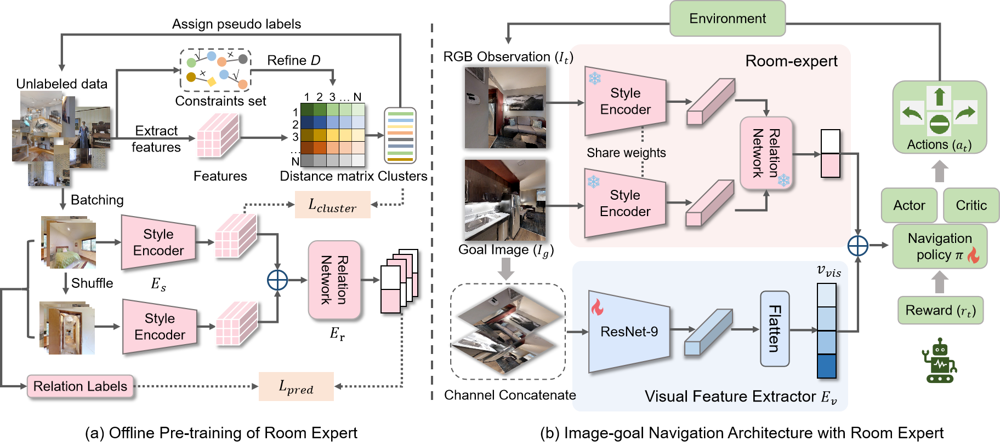

# REGNav 🤖
Official implementation of AAAI 2025 Oral accepted paper ["REGNav: RoomExpert Guided Image-Goal Navigation"]

 Pengna Li*, Kangyi Wu*, Jingwen Fu, Sanping Zhou†
 
 Institute of Artificial Intelligence and Robotics, Xi’an Jiaotong University
<br>
<!-- <p>
    <a href="https://www.easycounter.com/"></a>
</p> -->

## 0. Overview
Image-goal navigation aims to steer an agent towards the goal location specified by an image. If the agent is in a different room from the goal image, it’s extremely challeng
ing to identify their similarity and infer the likely goal location, which may result in the agent wandering around. Intuitively, when humans carry out this task, they may roughly compare the current observation with the goal image, having an approximate concept of whether they are in the same room before executing the actions. Inspired by this intuition, we try to imitate human behaviour and propose a Room Expert Guided Image-Goal Navigation model (REGNav) to equip the agent with the ability to analyze whether goal and observation images are taken in the same room. Specifically, we first pre-train a room expert with an unsupervised learning technique on the self-collected unlabelled room images. The expert can extract the hidden room style information of goal and observation images and predict their relationship about whether they belong to the same room. Extensive experiments show that our REGNav surpasses prior state-of-the-art works on three popular benchmarks. (i.e., Gibson, MP3D, and HM3D).



## 1. Install 🚀
### 1.1 Install habitat-lab 🛰️
```bash
# clone our repo
git clone https://github.com/leeBooMla/REGNav.git
cd REGNav

# clone habitat-lab code
git submodule init
git submodule update

# create conda env
conda create -n fgprompt python=3.8

# install habitat-sim
conda install habitat-sim=0.2.2 withbullet headless -c conda-forge -c aihabitat

# install pytorch1.11
pip install torch==1.11.0+cu113 torchvision==0.12.0+cu113 -f https://download.pytorch.org/whl/torch_stable.html

# install habitat-lab and habitat-baselines
cd habitat-lab
git checkout 1f7cfbdd3debc825f1f2fd4b9e1a8d6d4bc9bfc7
pip install -e habitat-lab 
pip install -e habitat-baselines
```
### 1.2 Install other requirements 🍔
```bash
cd ..
pip install -r requirements.txt
```

## 2. Prepare dataset 🗂️
<!-- 
| ObjectNav   |   Gibson     | train    |  [objectnav_gibson_train](https://utexas.box.com/s/7qtqqkxa37l969qrkwdn0lkwitmyropp)    | `./data/datasets/zer/objectnav/gibson/v1/` |
| ObjectNav   |   Gibson     | val    |  [objectnav_gibson_val](https://utexas.box.com/s/wu28ms025o83ii4mwfljot1soj5dc7qo)    | `./data/datasets/zer/objectnav/gibson/v1/` | -->

### 2.1 Download Datasets 📑
Download the `dataset.zip` file from [google drive](https://drive.google.com/file/d/1XNElxwOCUO8BDFO3U1g3wZTzcgjPeCdC/view?usp=drive_link) and unarchive it into `data/dataset`

For gibson dataset, we borrow the episodes generated from [`ZER`](https://github.com/ziadalh/zero_experience_required) to train our agent. We then follow the original [imagenav paper](https://github.com/facebookresearch/image-goal-nav-dataset) to test our well-trained agent on the testing episodes. We organize all datasets as follows:

```
data/datasets/
└── imagenav
    ├── gibson
    │   └── v1
    │       ├── train
    │       │   └── content
    │       └── val
    ├── hm3d
    │   └── v1
    │       ├── train
    │       │   └── content
    │       ├── val_easy
    │       │   └── content
    │       ├── val_hard
    │       │   └── content
    │       └── val_medium
    │           └── content
    └── mp3d
        └── v1
            ├── test_easy
            ├── test_hard
            └── test_medium
```

### 2.2 Download Scene Datasets 🕌
Please read the [official guidance](https://github.com/facebookresearch/habitat-sim/blob/main/DATASETS.md#gibson-and-3dscenegraph-datasets) to download `Gibson`, `HM3D`, and `MP3D` scene datasets, and put them in the `data/scene_datasets` directory using lower-case naming. **Feel free to let me know if you having problem downloading these scene files, I will share you a copy on my cloud disk.**
```
data/scene_datasets
├── gibson
├── hm3d
└── mp3d
```

## 3. Run ImageNav Training 🏂

### 3.1 Train the Room Expert 👒
We are organizing the training code and the self-collected dataset. Once we have finished it, we will make the public. 

You can directly download pretrained room expert weights [style_encoder.pkl](https://drive.google.com/file/d/1jJ0K9G1SG_MLKnJ9EcpuMuafIZs-_-3Y/view?usp=drive_link) and [relation_network.pkl](https://drive.google.com/file/d/1JWP-RO1r-Wc73pckfarkdrcQsQdJfof_/view?usp=sharing), and save them under a folder such as 'room_expert_ckpt/'. Then set the 'room_expert_ckpt_path_dir' in 'src/REGNav.yaml' as the path.

### 3.2 Train the Image-Goal Navigation Agent 🥽
```bash
python -m torch.distributed.launch \
--nproc_per_node=4 --master_port=15344 --nnodes=1 \
--node_rank=0 --master_addr=127.0.0.1 \
run.py \
--exp-config exp_config/ddppo_imagenav_gibson.yaml,policy,reward,dataset,sensors,REGNav \
--run-type train --model-dir results/train
```

## 4. Run Evaluation! 🏆
### 4.1 Download the Trained Model to Reproduce the Results 👯‍♀️

Download the trained checkpoint [REGNav](https://drive.google.com/file/d/16H47bP4b2oggnEmd5VAjclveMPF7zYz1/view?usp=sharing), and move to $checkpoint_path.

Eval the model on Gibson!

```bash
python -m torch.distributed.launch \
--nproc_per_node=1 --master_port=15244 --nnodes=1 \
--node_rank=0 --master_addr=127.0.0.1 \
run.py \
--exp-config exp_config/ddppo_imagenav_gibson.yaml,policy,reward,dataset,sensors,REGNav,eval \
--run-type eval --model-dir results/eval_gibson \
habitat_baselines.eval_ckpt_path_dir $checkpoint_path
```


### 4.2 Cross Domain Evaluation 🕺🏼
```bash
# train on gibson, eval on hm3d
python -m torch.distributed.launch \
--nproc_per_node=1 --master_port=15244 --nnodes=1 \
--node_rank=0 --master_addr=127.0.0.1 \
run.py \
--exp-config exp_config/ddppo_imagenav_gibson.yaml,policy,reward,dataset-hm3d,sensors,REGNav,eval \
--run-type eval --model-dir results/eval_hm3d \
habitat_baselines.eval_ckpt_path_dir $checkpoint_path
habitat_baselines.eval.split val_easy # choose from [val_easy, val_hard, val_medium]

# train on gibson, eval on mp3d
python -m torch.distributed.launch \
--nproc_per_node=1 --master_port=15244 --nnodes=1 \
--node_rank=0 --master_addr=127.0.0.1 \
run.py \
--exp-config exp_config/ddppo_imagenav_gibson.yaml,policy,reward,dataset-mp3d,sensors,REGNav,eval \
--run-type eval --model-dir results/eval_mp3d \
habitat_baselines.eval_ckpt_path_dir $checkpoint_path
habitat_baselines.eval.split test_easy # choose from [test_easy, test_hard, test_medium]
```

## Cite This Paper! 🤗
<!-- ```
@inproceedings{fgprompt2023,
 author = {Xinyu, Sun and Peihao, Chen and Jugang, Fan and Thomas, H. Li and Jian, Chen and Mingkui, Tan},
 title = {FGPrompt: Fine-grained Goal Prompting for Image-goal Navigation},
 booktitle = {37th Conference on Neural Information Processing Systems (NeurIPS 2023)},
 year = {2023},
} 
``` -->

## Acknowledgements 🙌

Thanks to Xinyu Sun for opening source of his excellent work [FGPrompt](https://github.com/XinyuSun/FGPrompt).